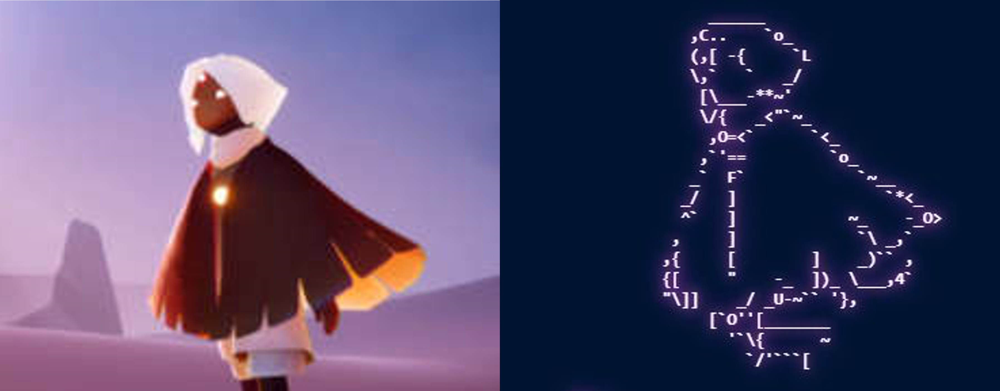

# Ascii Artist

An ascii art generator that's actually good. 
Does edge detection and selects the most appropriate characters.


<p align="center">
  
</p>

<p align="center">
  
</p>

<p align="center">
  
</p>

## Installing

### Installing with pip:

```
pip install asciiartist
```

### Installing from wheel:

Download the wheel file from this project's releases and run 

```
pip install <path/to/wheel>
```

## Quick Start

```py
from asciiartist import asciiartist, display_edges
from PIL import Image

img = Image.open("niko.png")

art, edges = asciiartist(
    img, # The image!
    30,  # Number of lines of the output ascii art
    noise_reduction=3,  # Level of noise reduction (optional)
    line_weight=1,      # Weight of the lines to draw (optional)
    text_ratio=2.2      # Height/width ratio of each character (optional)
)

print(art) # `art` is a string u can just print

# v Display the result of edge detection. 
#   Good for finetuning params.
display_edges(edges)
```

## Build from Source

Run the script `./model/model-gen.py` and build the wheel with `poetry build -f wheel`.

## How it works

Roughly, how _Ascii Artist_ generates the drawings:

1. Run edge detection
2. Segment the image for each char
3. Pass each segment through a [CNN](https://en.wikipedia.org/wiki/Convolutional_neural_network) to get the most appropriate character.

The CNN is trained with distorted images of characters (in font consolas),
created in a way that emulates the output of the edge detection.

## Bye

^-^

```
                                                        _.C\=-C`~(       
                                                      ```o''*~C`  `,     
                                                    '\_~_E_'O'```v, U_   
                                                 . ' :``      ````>`[cCO-
                                             __>'  `_ `~__         `O'`  
                                         _U<`             ^~      ,)     
                                     _U<'         _______,,~`~-~U/_/     
                                __~^`  _                `~~    ```       
                           __~*`        `C>_          ``[O               
                       __-``__I_=-~~-^`'  `>>    _U_-_- `                
                  __UC-**``.,U;#c'__**F'''-**`>=-````*`                  
         ____-~,_@C``[CC[`C[`    __                           _'         
  _U,_cF~'`'```      *__,.=='*^H__     `[`                  _/           
'``                             \                        _>K             
                                 `                    __/`               
                               ^{_   [               ``                  
                                     `<    ,                             
                                       `4\_[                             
                                         `{\`_                           
                                          \4\),_                         
                                    -*``ELU-,*UF-~o_@o,_                 
                    ___-~-`'``````  `` `''`````````[\ ``'                
         ___-=-*'```         ___         U,  --oIoE/    `,               
```